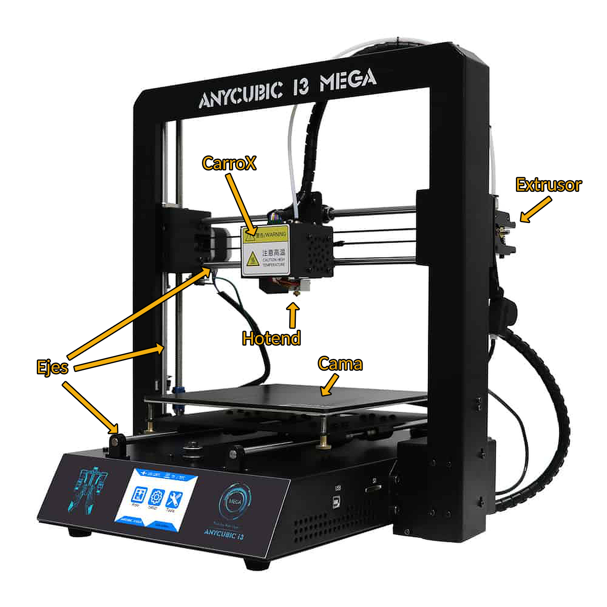
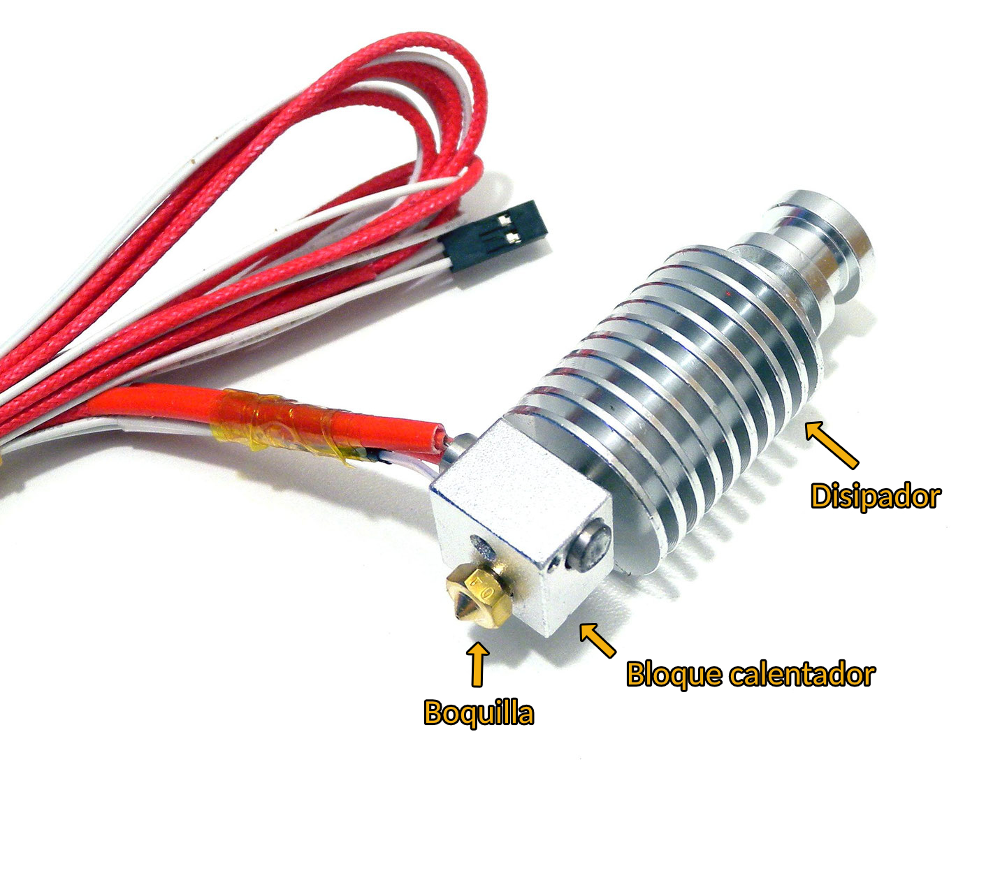

# Glosario partes de la impresora

Cuando empiezas en el mundo de la impresión 3D es muy común encontrarse con ayuda, guías, tutoriales o vídeos que hablan de partes que no tienes completamente identificadas. Para que quede todo claro, voy a enumerar las partes más importantes.

## General

- **Cama**: Cama (o muchas veces cama caliente) en la que la impresora deposita el filamento. Puede ser de cristal o de otros tipos.

- **Hot-end**: Literalmente significa extremo caliente en inglés. Es la parte por donde sale el filamento fundido. Tiene varias partes.

- **Extrusor**: Es el motor que tienes en un lateral de la impresora (en las impresoras de tipo "Directo", este motor está encima del hotend en vez de en el lateral). Este motor empuja filamento a través del tubo de teflón hacia el hot-end, para que salga filamento fundido.

- **Ejes**: Hay tres ejes, X, Y, Z. Son cada una de las direcciones en las que se mueve la impresora para imprimir. La cama se mueve de delante hacia detrás, el hotend se mueve de izquierda a derecha, y todo el eje X se mueve de arriba a abajo.

- **Carro X**: Es la caja en la que se mueve el hot-end por el eje X.

## Hot-end

- **Disipador**: También llamado heatsink. Disipa el calor.

- **Bloque calentador**: Como indica su nombre, es un bloque que calienta el filamento a su paso.

- **Boquilla**: También llamada nozzle o tobera. Es una boquilla de un diámetro determinado (típicamente, 0,4mm) por la que sale el filamento fundido.